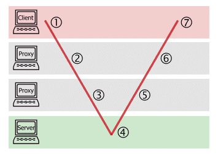

# 11.1 HTTP Request Methods (2 Punkte)

Zum Zugriff auf Ressourcen definiert die HTTP-Spezifikation ein sogenanntes Uniform Interface
(einheitliche Schnittstelle). Das bedeutet, dass jeder Server, der das HTTP-Protokoll unterstützt,
die selben, fest definierten Methoden anbietet um auf Ressourcen zuzugreifen1
. Dieses Konzept ermöglicht es, dass ein Browser mit jedem HTTP-Server kommunizieren kann, weil die
möglichen Kommunikationsmethoden fest vorgegeben und dem Browser bereits bekannt sind.
Um ein Uniform Interface zu realisieren ist es wichtig, dass die Semantik der einzelnen Methoden
genau spezifiziert ist. Dies ist in der zweiten HTTP-Spezifikation RFC 72312
in Abschnitt 4
beschrieben.
Erstellen Sie eine Tabelle, in der Sie die HTTP-Methoden auflisten und ihre Semantik kurz
beschreiben. Zusätzlich definiert die Spezifikation spezielle Eigenschaften. Erklären Sie diese
Eigenschaften und benennen Sie, welche Methode welche Eigenschaft besitzt.

**Lösung**

Eigenschaften:

> Idempotenz: Eine Methode ist idempotent, wenn jeder weitere Aufruf der Methode nichts am Zustand der Ressource verändert. Somit macht es keinen Unterschied ob der Request einmal oder mehrmals gemacht wurde.

```Java
a = 4; // idempotent
a++;   // nicht idempotent
```


> Safety: Sichere Methoden sind Methoden, welche read-only sind, d.h. sie haben keine Auswirkung auf den Zustand einer Ressource auf dem Server.

> Cacheable: Cacheable Methoden sind Methoden, deren Responses für die spätere Nutzung gespeichert werden können

**Tabelle**

| Methode | Semantik | Eigenschaft                 |
|---------|----------|-----------------------------|
| GET     | Ressource (z.B. eine Dateo) von einem Server anfordern         | safe, idempotent, cacheable |
| HEAD    | Header Daten einer Datei separat abfragen, ohne die ganze Datei übertragen zu müssen, z.B. um Dateigröße abzugragen ohne komplette Datei anzufordern         | safe, idempotent, cacheable |
| POST    | POST-Methoden senden Daten zur weiteren Verarbeitung an den Server um z.B. eine Ressource zu erstellen         | cacheable                   |
| PUT     | Ähnlich der POST-Methode, allerdings ist der Server nicht gezwungen die Daten an ein Skript weiterzuleiten, sondern nur an Ort und Stelle abzulegen. Exisitiert diese Datei dort schon, so wird sie ersetzt. Wird von den meisten Servern abgeschaltet.         | idempotent                  |
| DELETE  | Gegenstück zur PUT-Methode um eine Ressource zu löschen. Wird auch oft vom Server abgeschaltet.         |                             |
| CONNECT | Die CONNECT-Methode wird von Proxyservern implementiert, die in der Lage sind, SSL-Tunnel zur Verfügung zu stellen.         |                             |
| OPTIONS | Die OPTIONS-Methode liefert eine Liste der vom Server unterstützen Methoden und Merkmale.         | safe, idempotent            |
| TRACE   | Die TRACE-Methode dient der Nachverfolgung eines Requests bzw. des Responses. Sie liefert die Anfrage so zurück, wie der Server sie empfangen hat.         | safe, idempotent            |


**GET**

```
GET /index.php HTTP/1.1
Host: www.html-world.de
User-Agent: Mozilla/4.0
Accept: image/gif, image/jpeg, */*
Connection: close
```

```
GET /index.php?suche=html+css+xml HTTP/1.1
Host: www.html-world.de
...
```

**HEAD**

```
HEAD /downloads/gross.exe HTTP/1.0
Host: meinserver.de
User-Agent: Mozilla/4.0
Accept: image/gif, image/jpeg, */*
Connection: close
```

**POST**

```
POST /send.php HTTP/1.1
Host: meinserver.de
User-Agent: Mozilla/4.0
Accept: image/gif, image/jpeg, */*
Content-type: application/x-www-form-urlencoded
Content-length: 51
Connection: close

       
Vorname=Max&name=Mustermann&mail=max%40muster%2Ede
```

**PUT**

```
PUT /neu.html HTTP/1.1
Host: meinserver.de
User-Agent: Mozilla/4.0
Accept: image/gif, image/jpeg, */*
Content-type: text/html
Content-length: 18

       
<p>Neue Datei</p>
```

**DELETE**

```
DELETE /neu.html HTTP/1.1
Host: meinserver.de
User-Agent: Mozilla/4.0
Accept: image/gif, image/jpeg, */*
```

**CONNECT**

```
CONNECT server.example.com:80 HTTP/1.1 
Host: server.example.com:80 
Proxy-Authorization: basic aGVsbG86d29ybGQ=
```

**OPTIONS**

```
OPTIONS / HTTP/1.1
Host: www.html-world.de
```

**TRACE**

```
[An Stelle 1:]
TRACE / HTTP/1.1
Host: server.de
Max-Forwards: 5
 
[An Stelle 2:]
TRACE / HTTP/1.1
Host: server.de
Max-Forwards: 4
Via: 1.1 Proxy_1
 
[An Stelle 3:]
TRACE / HTTP/1.1
Host: server.de
Max-Forwards: 3
Via: 1.1 Proxy_1, 1.1 Proxy_2

       
[An Stelle 4 bis 7:]
HTTP/1.1 200 OK
Content-Type: message/http
Content-length: 81

       
TRACE / HTTP/1.1
Host: server.de
Max-Forwards: 3
Via: 1.1 Proxy_1, 1.1 Proxy_2
```

